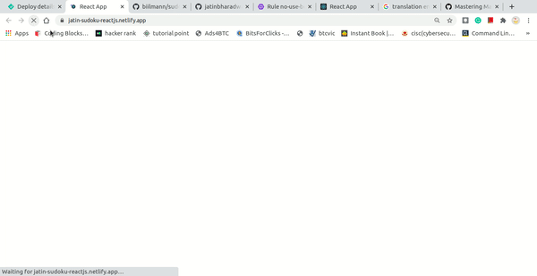

# Sudoku Game- Using ReactJs and NodeJS
A sudoku app with ReactJS and Deployed on netlify

## Deploy on Netlify
[Click Here](https://jatin-sudoku-reactjs.netlify.app/)




### How to run this project 
1. Download the repository or clone the repository
    ```git
      git clone https://github.com/jatinbharadwaj/sudoku_reactjs.git

    ```
2. Run commands on terminal or cmd
```npm
    npm install
    npm run start
```
3. Pre-requisite

  * node --version
  * npm --version
  * create-react-app

